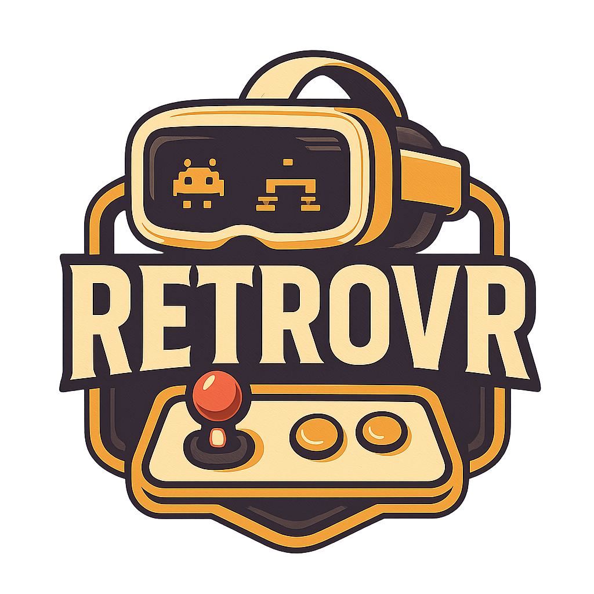

  

# 🎮 RetroVR

RetroVR é um projeto de emulação de consoles retrô desenvolvido em **Unity** com foco em **Realidade Virtual (Meta Quest)**.
O objetivo é criar uma experiência imersiva onde o jogador interage fisicamente com consoles, cartuchos e TVs dentro de um ambiente 3D.

O projeto é **standalone**, não precisa de PC para rodar, e é focado em uma experiência nostálgica e intuitiva.

# DISCAIMER
Este projeto é para fins educacionais e de desenvolvimento. Ele não inclui ROMs ou BIOS de consoles, e os usuários devem fornecer seus próprios arquivos para emulação. O uso de ROMs e BIOS deve estar em conformidade com as leis de direitos autorais aplicáveis.

O projeto ainda é um protótipo em desenvolvimento, e pode conter bugs ou limitações. Feedbacks e contribuições são bem-vindos para melhorar a experiência.

