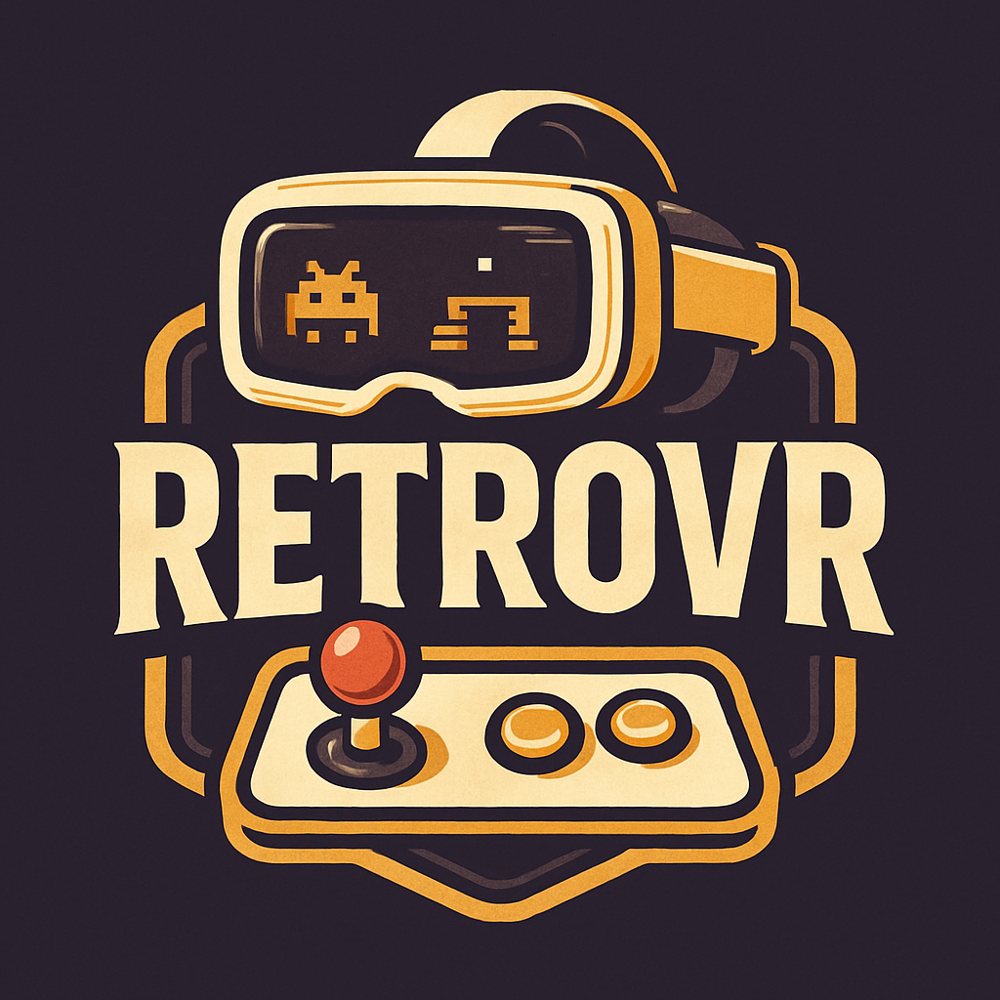

<p align="center">

</p>

# 🎮 RetroVR

Um projeto de emulação de consoles retrô desenvolvido em **Unity**, focado em VR (Meta Quest), que oferece um ambiente imersivo, sistema de inventário, leitura automática de ROMs, configurações de mundo e um quarto totalmente customizável. O objetivo é proporcionar uma experiência standalone, intuitiva e nostálgica para fãs de jogos clássicos.

---

## ✨ Principais Funcionalidades

- **Emulação de Consoles Retrô**: Suporte a múltiplos consoles via Libretro.
- **Inventário Dinâmico**: Gerencie consoles, cartuchos, telas e acessórios de forma intuitiva.
- **Leitura Automática de ROMs**: Detecção e organização automática dos jogos.
- **Quarto Customizável**: Personalize o ambiente VR com objetos, móveis e disposição dos consoles.
- **Sistema de Cabos Realista**: Conecte fisicamente consoles, telas e controles para maior imersão.
- **Salvamento de Estado**: Save states individuais por jogo e save completo do ambiente.
- **Standalone VR**: Desenvolvido para rodar diretamente em dispositivos como Meta Quest, sem necessidade de PC.

---

## 🛠️ Tecnologias / Libs

| Tecnologia        | Versão / Badge                                                                 |
|-------------------|------------------------------------------------------------------------------|
| Unity             |  |
| XR Interaction Toolkit |  |
| OpenXR Plugin     |  |
| Newtonsoft Json   |         |
| URP               |                       |
| Libretro          |            |
| C#                |  |


---

## 📂 Estrutura de Pastas Externas

```plaintext
com.unity.RetroVR/
├── files
│   ├── Libretro/
│   │   ├── config/
│   │   │   └── settings.json        # Configurações do usuário e caminhozs externos
│   │   ├── roms/                    # ROMs dos jogos
│   │   │   ├── <ConsoleName>/
│   │   ├── cores/                   # Cores Libretro (.so)
│   │   ├── labels/                  # Artes dos jogos <GameName>.png / .jpg
│   │   │   ├── <ConsoleName>/
│   │   ├── saves/                   # Save states por ROM <GameName>
│   │   └── worldSaves/              # Save do mundo/ambiente
```

---

## 🚀 Como Instalar

1. **Baixe o APK:** Faça o download da versão mais recente.
2. **Instale via SideQuest:** Use o SideQuest para instalar no seu Meta Quest.

---

## 🤲 Como Contribuir

1. **Instale o Unity:** Utilize a versão 6000.1.14f1.
2. **Clone o Projeto:** Faça o clone deste repositório.
3. **Abra no Unity:** Importe o projeto e siga as instruções de build.
4. **Sugira Melhorias:** Abra issues ou envie pull requests com correções e novidades.

---

## 📋 Roadmap

Acompanhe as principais tarefas e o progresso do projeto:

<details>
<summary><strong>Consoles</strong></summary>

- [x] Criar um arquivo de Dados do console contento as configurações
    - [x] Nome do console
    - [x] Nome do core
    - [x] Extenções permitidas
    - [x] É portatil
- [x] Criar uma instancia do console para receber o arquivo de dados
    - [x] Arquivo de dados
    - [x] Referencia da tela
        - [ ] Receber a tela por cabo
    - [ ] Referencia dos controles
        - [ ] Receber controles por cabo
    - [ ] Referencia de energia
        - [ ] Receber energia por cabo
    - [ ] Memoria card ou memoria interna
        - [ ] Adicionar uma referencia de memory card
    - [x] Instancia do console pelo libretro
    - [x] Referencia do label do nome
        - [x] Instancia automaticamente
    - [x] Definição se está rodando/executando ou não
    - [x] Cartucho inserido
    - [x] Função para inserir cartucho
        - [x] Pega a instancia do slot de cartucho
        - [x] Extrai os dados do cartucho
        - [x] Adiciona os dados na instancia do libretro
    - [x] Função para remover cartucho
        - [x] Remove a instancia do cartucho inserido
        - [x] Para a execução caso ainda não tiver parado
        - [x] Limpa a instancia do libretro
    - [x] Função de Ligar
        - [ ] Atribuir ao botão
    - [x] Função de Fesligar
        - [ ] Atribuir ao botão
    - [ ] Função para gerenciar inputs
        - [ ] Limit de inptus
        - [ ] Função para focar o input no console
        - [ ] Função para desfocar o input do console
        - [ ] Atribuir a função pela referencia de cabo
    - [ ] Função para salvar o game em um memory card ou memoria interna
    - [ ] Função para carregar o game salvo
    - [ ] Função para identificar consoles portateis e encontrar a tela
- [ ] Criar um prefab default para os consoles
    - [x] Criar uma exibição do nome do console
    - [x] Criar um slot de cartucho interativo
    - [ ] Criar uma conexão com a tela via cabo
    - [ ] Criar uma conexão de energia/tomada via cabo
    - [ ] Criar uma conexão com o controle do console via cabo
    - [ ] Criar um botão de Liga/Desliga
    - [ ] Criar um botão de reset
    - [ ] Criar Leds para identificar cada uma das conexões
    - [ ] Criar um Slot para memory card
    - [ ] Criar uma variante com tela inbutida/portatil
</details>

<details>
<summary><strong>Telas</strong></summary>

- [ ] Criar um arquivo de instancia para telas
    - [ ] Função liga e desliga
    - [ ] Função de aumentar ou abaixar volume
- [ ] Criar um prefab
    - [x] Tela com um mesh renderer
        - [x] incluir Audio source
        - [x] incluir Audio Processor
    - [ ] Incluir materiais customizados
    - [ ] Receber energia por cabo
    - [ ] Botão liga e desliga
    - [ ] Botão de volume + / -
    - [ ] Receber comandos por controle
        - Criar um prefab de controle
</details>

<details>
<summary><strong>Cartuchos / Jogos</strong></summary>

- [x] Criar um arquivo de dados de jogos
    - [x] Nome do Jogo
    - [x] Diretorio do jogo
    - [x] Diretorio de save
    - [x] Extensão do jogo
    - [x] Sobreposição de core
    - [ ] Label / Arte Customizada
- [ ] Criar um arquivo de instancia de jogos
    - [x] Arquivo de dados
    - [x] Referencia do label do nome
        - [x] Instancia automaticamente
    - [ ] Gerenciador de arte
- [ ] Criar um prefab default para os cartuchos
    - [ ] Material customizado para artes
    - [x] Label para exibir o nome
</details>

<details>
<summary><strong>Cabos</strong></summary>

- [ ] Criar um arquivos de dados para o cabo
    - [ ] Tipo de cabo
        - [ ] Energia
        - [ ] Imagem
        - [ ] Controle
    - [ ] Cor do cabo
- [ ] Criar uma instancia para o cabo
    - [ ] input
    - [ ] output
    - [ ] Arquivo de dados de cabo
    - [ ] Função para transmitir os dados do input para o output
        - [ ] Gerenciar cabos de energia
        - [ ] Gerenciar cabos de imagem
        - [ ] Gerenciar cabos de controle
    - [ ] Criar um prefab default para o cabo
    - [ ] Uma ponta com uma tag de WireInput
    - [ ] Uma ponta com uma tag de WireOutput
    - [ ] Um material com cor dinamica
</details>

<details>
<summary><strong>Game Manager</strong></summary>

- [x] Verificar / Criar estrutura de pasta externa
- [x] Escanear pastas de jogos
    - [x] Criar arquivo de dados dos jogos com base no scan
        - [ ] Criar instancias dos jogos e carregar no inventário
    - [ ] Gerenciar labels de jogos
- [ ] Escanear pastas de cores
    - [ ] Criar arquivo de dados dos cores para cada console com base no scan
        - [ ] Criar instancias dos consoles e carregar no inventário
- [ ] Copiar cores testados internamente para pasta externa
    - [ ] Permitir a edição de cores
    - [ ] Baixar cores automaticamente
</details>

<details>
<summary><strong>UI</strong></summary>

- [ ] Criar um menu
    - [ ] Lista de jogos drag and drop
    - [ ] Lista de consoles drag and drop
    - [ ] Lista de Telas drag and drop
    - [ ] Tela de configurações
        - [ ] Configuração de audio
        - [ ] Configuração de graficos
        - [ ] Configuração de save de mundo
</details>

---

## 📸 Screenshots

> _Adicione imagens do ambiente VR, inventário, consoles e interações para ilustrar o projeto!_

---

## 🤝 Contribuindo

Contribuições são muito bem-vindas! Sinta-se à vontade para abrir issues, enviar pull requests ou sugerir melhorias.

---

## 📄 Licença

Este projeto está sob a licença MIT. Veja o arquivo [LICENSE](LICENSE) para mais detalhes.

---

## 💬 Contato

Dúvidas, sugestões ou feedback? Abra uma issue ou entre em contato pelo [GitHub Issues](../../issues).

---
