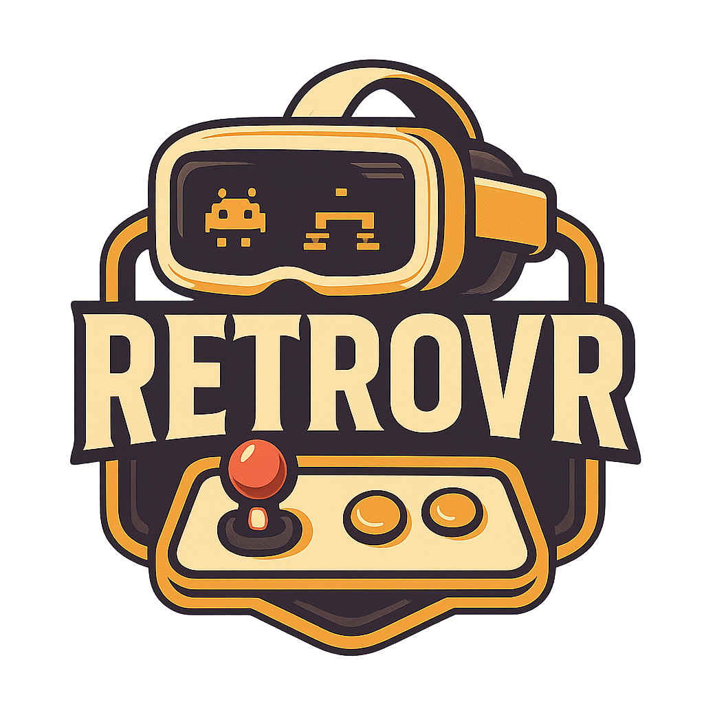
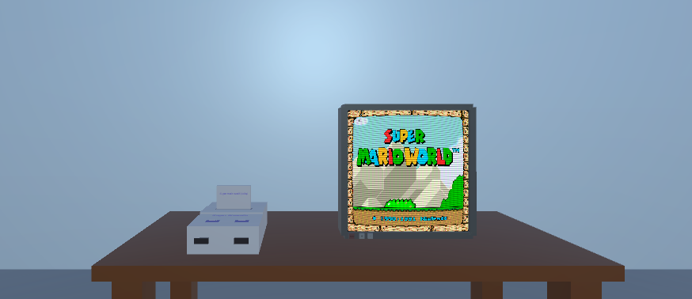

  

# 🎮 RetroVR

RetroVR é um projeto de emulação de consoles retrô desenvolvido em **Unity** com foco em **Realidade Virtual (Meta Quest)**.
O objetivo é criar uma experiência imersiva onde o jogador interage fisicamente com consoles, cartuchos e TVs dentro de um ambiente 3D.

O projeto é **standalone**, não precisa de PC para rodar, e é focado em uma experiência nostálgica e intuitiva.

## 🛠️ Tecnologias / Libs

| Tecnologia        | Versão / Badge                                                                 |
|-------------------|------------------------------------------------------------------------------|
| Unity             |  |          |
| C#                |  |

---

## 📸 Screenshots

  

---

## 📄 Licença

Este projeto está sob a licença **MIT**.
Veja o arquivo [LICENSE](./LICENSE).

---

## 💬 Contato

Abra uma issue em:
<https://github.com/SophiaFrassetto/RetroVR/issues>
