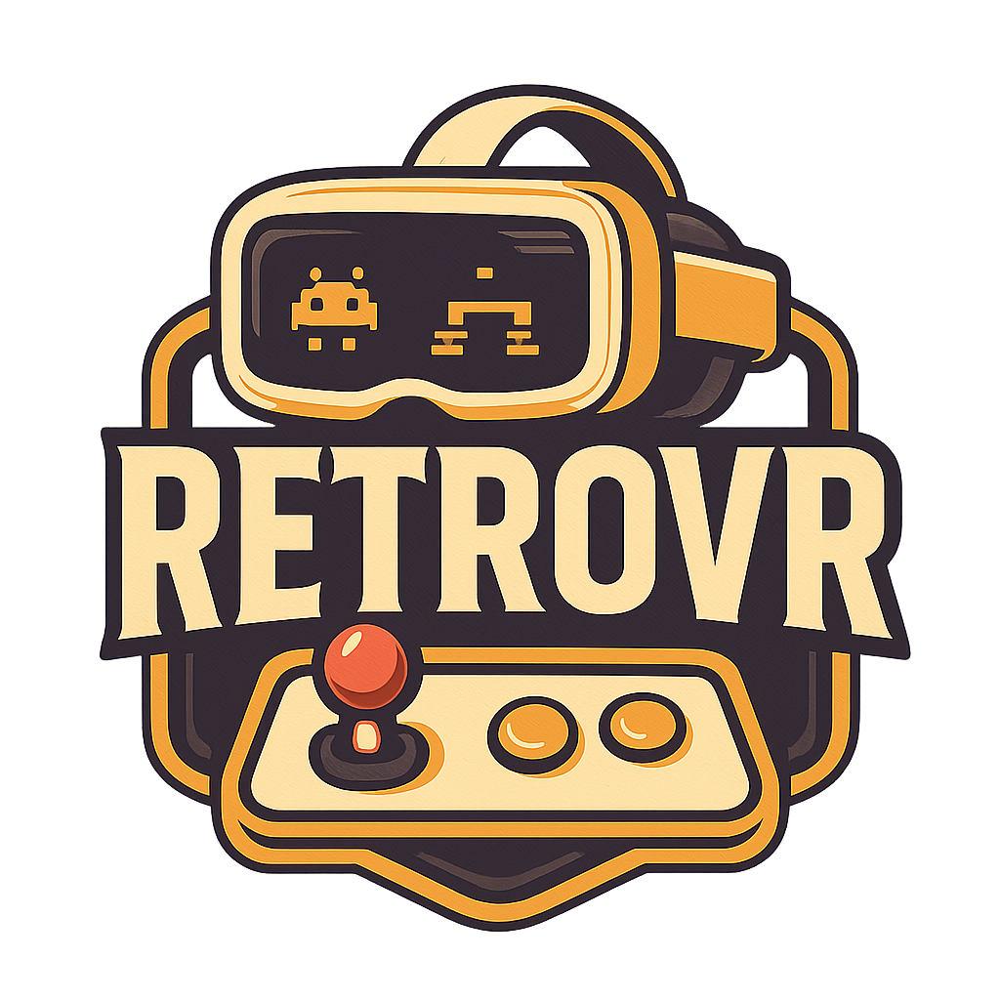

# 🎮 RetroVR

Um projeto de emulação de consoles retrô desenvolvido em **Unity**, focado em VR (Meta Quest), que oferece um ambiente imersivo, sistema de inventário, leitura automática de ROMs, configurações de mundo e um quarto totalmente customizável. O objetivo é proporcionar uma experiência standalone, intuitiva e nostálgica para fãs de jogos clássicos.

---

## ✨ Principais Funcionalidades

- **Emulação de Consoles Retrô**: Suporte a múltiplos consoles via Libretro.
- **Inventário Dinâmico**: Gerencie consoles, cartuchos, telas e acessórios de forma intuitiva.
- **Leitura Automática de ROMs**: Detecção e organização automática dos jogos.
- **Quarto Customizável**: Personalize o ambiente VR com objetos, móveis e disposição dos consoles.
- **Sistema de Cabos Realista**: Conecte fisicamente consoles, telas e controles para maior imersão.
- **Salvamento de Estado**: Save states individuais por jogo e save completo do ambiente.
- **Standalone VR**: Desenvolvido para rodar diretamente em dispositivos como Meta Quest, sem necessidade de PC.

