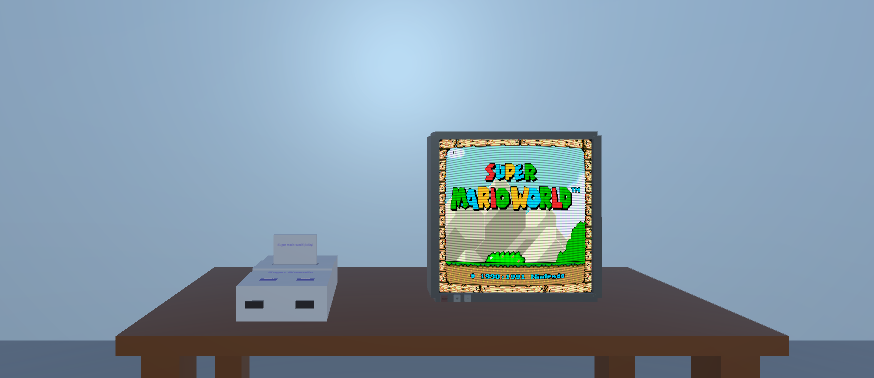

<p align="center">
  
</p>

# 🎮 RetroVR

RetroVR is a retro console emulation project developed in **Unity**, focused on **Virtual Reality (Meta Quest)**.
The goal is to create an immersive experience where the player physically interacts with consoles, cartridges and TVs inside a 3D environment.

This is a **standalone** project — no PC is required — focused on delivering a nostalgic and intuitive experience.

---

## 🌎 Leia em Português
➡️ [README.md](./README.md)

---

## ✨ Main Features

- Retro console emulation via **Libretro**.
- 3D VR environments with physical interaction.
- Functional consoles with **physical cartridge slot**.
- Interactive cartridges with “insert and run” system.
- Functional VR TV with:
  - real-time video output
  - working audio

---

## ✅ Current Project Status

The project already includes:

✅ Functional VR room (placeholder)

✅ Automatic external folder creation

✅ Functional physical console in VR
- Real cartridge slot
- Automatic power-on when inserting a cartridge

✅ Interactive physical cartridges (XRGrab)

✅ Functional physical TV in VR
- Working video output
- Working audio

✅ Prefab system for:
- Consoles
- Cartridges

✅ Script-based configuration:
- Core per console
- Accepted extensions
- Cartridge core override

The full flow already works:

**Grab cartridge → Insert → Console powers on → Game runs with video and sound**

---

## 🛠️ Technologies / Libs

| Technology | Version / Badge |
|------------|------------------|
| Unity |  |
| C# |  |

> ⚠️ **Important Notice**
> The project was updated from Unity **6000.1.14f1** to **6000.0.64f1** due to security vulnerabilities found in the previous version.
> It was also changed from 6.1 to 6.0 to align with the version used by the Lib [SK.Libretro](https://github.com/Skurdt/SK.Libretro) and maintain maximum compatibility.
> We strongly recommend contributors use only the current version to avoid compatibility issues and security risks.

---

## 📂 External Folder Structure

```plaintext
com.unity.RetroVR/
├── files
│   ├── Libretro/
│   │   ├── config/
│   │   ├── roms/
│   │   ├── cores/
│   │   ├── labels/
│   │   ├── saves/
│   │   └── worldSaves/
```

---

## 🚀 How to Install

1. Download the APK from the **Releases** section.
2. Install it on your Meta Quest using **SideQuest**.

---

## 🗺️ Roadmap

The full roadmap is available in separate files:

- 🇺🇸 English: [ROADMAP_EN.md](./ROADMAP_EN.md)
- 🇧🇷 Portuguese: [ROADMAP.md](./ROADMAP.md)

---

## 🤲 How to Contribute

The contribution guide is also available in separate files:

- 🇺🇸 English: [CONTRIBUTING_EN.md](./CONTRIBUTING_EN.md)
- 🇧🇷 Portuguese: [CONTRIBUTING.md](./CONTRIBUTING.md)

---

## 📸 Screenshots

<p align="center">
  
</p>

---

## 📄 License

This project is licensed under the **MIT License**.
See the [LICENSE](./LICENSE) file for more details.

---

## 💬 Contact

Open an issue at:  
https://github.com/SophiaFrassetto/RetroVR/issues
